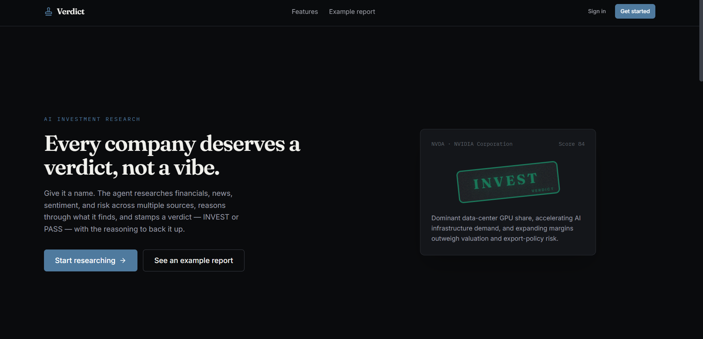
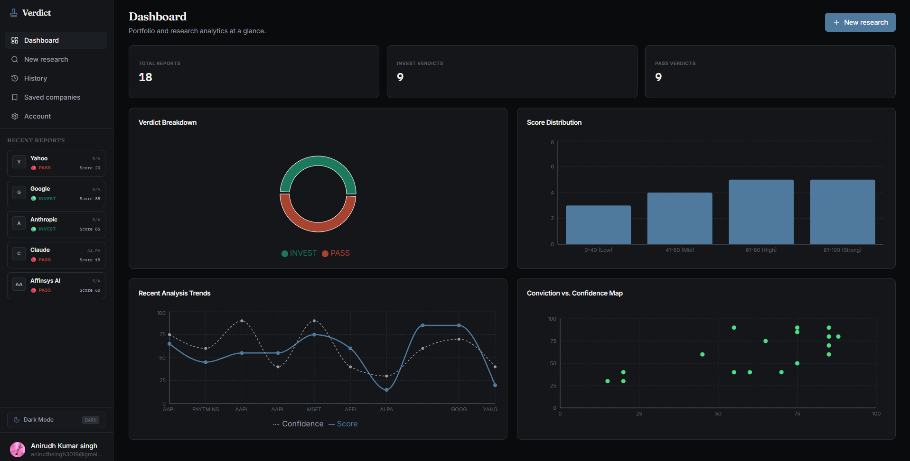
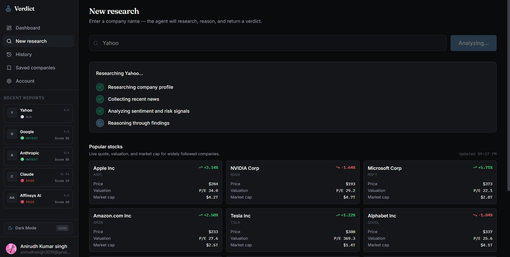
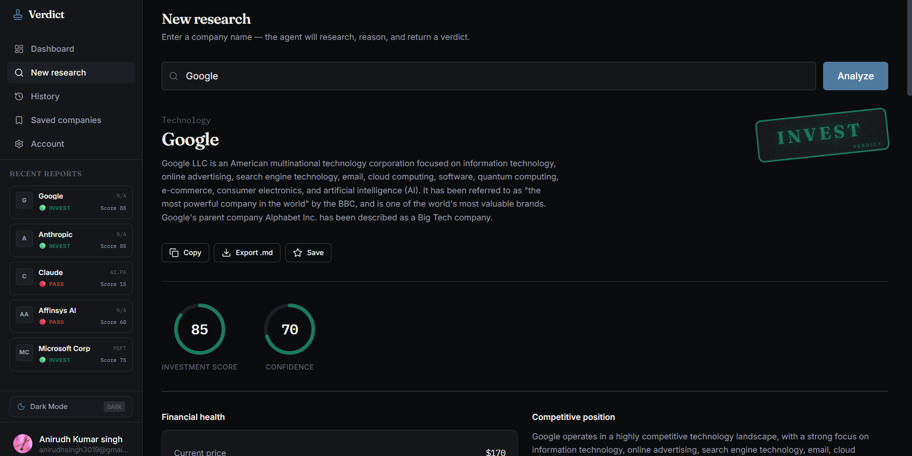

# Verdict — AI Investment Research Agent

Give it a company name. A LangGraph agent researches financials, news,
sentiment, and risk across multiple sources, reasons through everything it
finds, and returns a structured **INVEST / PASS** verdict — with the
reasoning, scores, and sources to back it up.

This was built as an internship project. The goal was to make every layer
(backend architecture, agent design, data model, frontend) something that
can be opened up and explained line-by-line in an interview, not a black box
that happens to work.

---

## Table of contents

- [Overview](#overview)
- [Architecture](#architecture)
- [Folder structure](#folder-structure)
- [Tech stack](#tech-stack)
- [Environment variables](#environment-variables)
- [Installation](#installation)
- [How it works](#how-it-works)
- [API documentation](#api-documentation)
- [Testing](#testing)
- [Deployment](#deployment)
- [Trade-offs](#trade-offs)
- [Future improvements](#future-improvements)
- [Example output](#example-output)
- [Screenshots](#screenshots)

---

## Overview

The product has two halves:

1. **A Node.js Express backend** running a 4-node LangGraph.js pipeline:
   `research profile -> collect news -> sentiment & risk -> LLM reasoning`.
   Each research step pulls from a different external API (Tavily, Finnhub,
   NewsAPI, Wikipedia), and every one of them degrades gracefully if its key
   isn't configured — the agent still runs and still returns a verdict, just
   with a lower confidence score and an explicit note about what was missing.

2. **A React + TypeScript frontend** with a dashboard, a live-streaming
   research page (you watch each pipeline step complete in real time over
   Server-Sent Events), full report history, and saved companies — built
   with shadcn-style components on Tailwind v4, Framer Motion for the
   interface's only deliberately loud element (the verdict stamp), and
   Clerk for auth.

Everything — Clerk, all three LLM providers, all four research tools, and
Neon Postgres — is wired up to work with **real keys you provide**. With
zero keys configured, the backend still boots, the frontend still works
end-to-end against Neon Postgres and a dev-mode auto-user, and
every endpoint responds correctly; only the LLM reasoning step (and any
research source missing its key) will report that it's unavailable, instead
of crashing.

---
## Architecture

```
React (Vite) <--HTTPS/SSE--> Express (Node.js) backend
                                  |
                  routers/  ->  services/  ->  Prisma ORM
                                  |                  |
                                  v                  v
                              agents/          Neon Postgres
                           (LangGraph.js)
                                  |
                                  v
                              tools/  -->  Tavily / Finnhub / NewsAPI / Wikipedia
                                  |
                                  v
                              llm/  -->  Gemini / OpenAI / Anthropic
```

**Why this shape:**

- **Routers never contain business logic.** Every router function is
  3-6 lines: validate input via a Zod schema, call a service function,
  return the result. All actual logic — orchestrating the agent, persisting
  reports, computing usage stats — lives in `services/`. This is what makes
  the routers trivial to read and the business logic independently testable.

- **The LLM provider is swappable from one file.** `src/llm/index.ts` is
  the only file that imports the provider classes. Every agent node
  calls `getLLMProvider()` and only ever sees the abstract provider
  interface — it has no idea whether it's talking to Gemini, OpenAI, or
  Claude. Adding a fourth provider means registering it in `src/llm/index.ts`.

- **Every research tool returns a `ToolResult`, never raises.** `src/tools/base.ts`
  defines the `ToolResult` interface and `ToolResultHelper.unavailable(...)` / `ToolResultHelper.ok(...)` as the only
  two ways a tool function can return. A missing API key, a network
  timeout, and an empty result set are all handled the same way — the
  agent's reasoning node sees which sources were unavailable and is
  explicitly instructed to lower its confidence score accordingly, rather
  than the pipeline crashing or silently fabricating data.

- **Auth has the same graceful-degradation shape as the LLM layer.**
  `src/auth/middleware.ts`'s `requireAuth` checks
  `settings.authConfigured` (are `CLERK_SECRET_KEY` + `CLERK_JWKS_URL` +
  `CLERK_ISSUER` all set?) before trying to verify a real token. If Clerk
  isn't configured, it falls back to a single deterministic dev user — this
  fallback is hard-disabled in production (`NODE_ENV=production`) so it can
  never accidentally ship.

---

## Folder structure

```
├── backend/                  # Node.js + Express backend
│   ├── prisma/               # Prisma database schema definition
│   └── src/
│       ├── agents/           # LangGraph.js nodes and state graph
│       ├── auth/             # Clerk authentication middleware
│       ├── llm/              # Unified LLM provider wrappers
│       ├── routers/          # Express API endpoints
│       ├── services/         # Orchestration & DB business logic
│       ├── tools/            # Real-time search/data tools (Tavily, Finnhub, etc.)
│       ├── types/            # Zod validation schemas
│       ├── config.ts         # Environment validation
│       ├── db.ts             # Prisma client instance
│       └── main.ts           # Express server entry point
├── frontend/                 # React + TypeScript frontend
│   └── src/
│       ├── components/       # UI elements (shadcn-style, metrics dashboards)
│       ├── contexts/         # Authentication and theme state
│       ├── pages/            # Dashboard, Research, Saved, Settings
│       ├── services/         # Fetch API client and SSE client wrapper
│       └── main.tsx          # React render entry point
└── README.md                 # Main workspace documentation
```

## Tech stack

| Layer | Tech Stack | Purpose |
| --- | --- | --- |
| **Frontend** | React (Vite), TypeScript | Modern reactive UI structure |
| **Styling** | Tailwind CSS v4, Framer Motion | Sleek dark-mode dashboards with premium micro-animations |
| **Backend** | Express (Node.js), TypeScript | Low-overhead routing, SSE support, and developer workflow |
| **AI Orchestration** | LangGraph.js, Zod | Stateful agent pipeline with strict schema validation |
| **Database** | Neon serverless PostgreSQL | Highly scalable, serverless SQL storage for history and user data |
| **ORM** | Prisma | Schema-first database queries with strong type safety |
| **Auth** | Clerk | Multi-tenant auth with local development fallback |

## Environment variables

To run the application, copy the example environment files and populate them with your keys:

### Backend Configuration (`backend/.env`)

Create `backend/.env` with the following:
- `DATABASE_URL`: Connection string for your Neon Postgres instance.
- `CLERK_SECRET_KEY` & `CLERK_PUBLISHABLE_KEY`: Keys from your Clerk dashboard.
- `CLERK_JWKS_URL` & `CLERK_ISSUER`: Clerk JWT verification configurations.
- `GOOGLE_API_KEY`: API key for Google Gemini model reasoning (recommended: `gemini-2.0-flash`).
- `TAVILY_API_KEY`: API key for Tavily search queries (used in news & sentiment retrieval).
- `FINNHUB_API_KEY`: API key for Finnhub company symbol and financial search.
- `NEWS_API_KEY`: API key for general news search (optional, degrades gracefully).

### Frontend Configuration (`frontend/.env`)

Create `frontend/.env` with the following:
- `VITE_CLERK_PUBLISHABLE_KEY`: Clerk publishable key (leave empty to bypass authentication locally).
- `VITE_API_BASE_URL`: Base URL of the running backend (defaults to `http://localhost:8000/api/v1`).

---

## Installation

### Backend

```bash
cd backend
npm install
cp .env.example .env               # fill in database URL and API keys

# Push schema to your Neon PostgreSQL database
npx prisma db push

# Run development server (via ts-node-dev)
npm run dev
```

The API is now running at `http://localhost:8000`. The routes are mapped and managed inside `src/routers/`.

### Frontend

```bash
cd frontend
npm install
cp .env.example .env               # fill in Clerk key if you have one
npm run dev
```

The app is now running at `http://localhost:5173`.

### Running with zero API keys

Both halves work out of the box with nothing configured:

- The backend boots using the Neon PostgreSQL database URL and uses the mock user fallback if Clerk keys are blank.
- The frontend runs against that same dev-mode user — no sign-in screen is prompted.
- The research pipeline runs all the way through but will gracefully fail during the LLM reasoning step with a detailed database log and client-side error message if LLM API keys are missing or hit rate limits (e.g. Gemini 429), rather than crashing.

This is the fastest way to verify the whole system end-to-end before wiring
up any real credentials.

---

## How it works

1. **You enter a company name** on the research page.
2. **`research_profile` node** resolves a ticker symbol (via Finnhub's
   symbol lookup) and pulls a company profile from Wikipedia and Finnhub.
3. **`collect_news` node** gathers recent headlines from NewsAPI, Finnhub's
   company-news endpoint, and a Tavily web search, in parallel.
4. **`sentiment_and_risk` node** runs two more targeted Tavily searches —
   one for investor sentiment, one for risks/controversies/regulatory exposure.
5. **`llm_reasoning` node** feeds everything gathered so far (explicitly
   marking which sources were unavailable) to whichever LLM provider is
   configured, with a system prompt instructing it to reason like a
   skeptical equity analyst and return a strictly-typed `StructuredReport` —
   industry, financial health, SWOT, signals, risks, an investment score, a
   confidence score, and a final INVEST/PASS verdict with detailed reasoning.
6. The result is persisted to the `reports` table and streamed back to the
   frontend over Server-Sent Events, one pipeline step at a time, so the UI
   can show live progress instead of a single multi-second spinner.

---

## API documentation

Summary of the REST API surface:

| Method | Path | Description |
|---|---|---|
| `POST` | `/api/v1/analyze` | Run the full pipeline synchronously, return the completed report |
| `GET` | `/api/v1/analyze/stream` | SSE stream of pipeline progress + final report |
| `POST` | `/api/v1/analyze/{id}/retry` | Re-run the pipeline for an existing report |
| `GET` | `/api/v1/reports` | Paginated report history |
| `GET` | `/api/v1/report/{id}` | Single report detail |
| `DELETE` | `/api/v1/report/{id}` | Delete a report |
| `POST` | `/api/v1/favorite` | Toggle favorite on a report |
| `GET` | `/api/v1/profile` | Current user's profile |
| `GET` / `PATCH` | `/api/v1/settings` | Get / update user settings |
| `GET` / `POST` | `/api/v1/saved-companies` | List / add a saved company |
| `DELETE` | `/api/v1/saved-companies/{id}` | Remove a saved company |
| `GET` | `/api/v1/usage` | Aggregated API usage stats by provider |
| `GET` | `/api/v1/status` | Which LLM providers / research tools / auth are configured |
| `GET` | `/api/v1/health` | Health check |

---


## Deployment

### Database — Neon

1. Create a project at neon.tech, copy the pooled connection string.
2. Set `DATABASE_URL=postgresql://...` in your backend environment (no special asynchronous driver suffixes like `+asyncpg` are required for Prisma).
3. Run `npx prisma db push` once from the command line pointing to this database URL to create/sync the database tables.

### Backend — Render

1. New Web Service -> connect this repo, root directory `backend`.
2. Build command: `npm install && npm run build`
3. Start command: `npm start`
4. Add all backend environment variables from `.env.example` in Render's dashboard.
5. In Render, set the build-command or pre-deploy command to run `npx prisma db push` to automate database syncing on deploys.

### Frontend — Vercel

1. Import this repo, root directory `frontend`.
2. Framework preset: Vite.
3. Add `VITE_CLERK_PUBLISHABLE_KEY` and `VITE_API_BASE_URL` (pointing at
   your deployed Render URL + `/api/v1`) as environment variables.
4. Deploy.

### Clerk

1. Create an application at clerk.com.
2. Frontend: copy the publishable key into `VITE_CLERK_PUBLISHABLE_KEY`.
3. Backend: copy the secret key into `CLERK_SECRET_KEY`, and find your
   JWKS URL and issuer under API Keys -> Show JWT public key (issuer is
   your Frontend API URL, JWKS URL is `<issuer>/.well-known/jwks.json`).
4. Add your deployed frontend URL to Clerk's allowed origins.

---

## Trade-offs

Documented deliberately, since these are the first things worth being able
to explain and defend:

- **Manual type synchronization instead of codegen.** Frontend types (like report structures) are manually kept in sync with the backend Zod validation schemas and Prisma models. While automated OpenAPI generation would eliminate potential drift, manual definition was chosen to keep build tooling lightweight and eliminate cross-directory compilation dependencies.
- **SSE instead of WebSockets for streaming.** Progress only flows
  server->client, so SSE is simpler to implement, simpler to consume (no
  socket lifecycle), and works through standard HTTP infrastructure. The
  trade-off is no client->server messages mid-stream (e.g. a "cancel"
  button has to be implemented via `AbortController` + the connection
  closing, not an in-band message).
- **`/analyze` (non-streaming) re-runs the whole pipeline inline and blocks
  the request** until it finishes. This is intentional and simple, but on a
  slow LLM provider this could take 10-20+ seconds. The streaming endpoint
  (`/analyze/stream`) is the one the UI actually uses for this reason — the
  blocking endpoint exists for programmatic/API use where streaming isn't
  needed.
- **Dev-mode auto-user is a deliberate, hard-coded single user**, not a
  general "no-auth mode" — it exists purely so the rest of the product is
  testable before Clerk is wired up, and is explicitly disabled the moment
  `APP_ENV=production`.
- **Backend Stack Rewrite (Python to Node.js/TypeScript)**: The initial backend prototype was built using Python and FastAPI. However, to align with the take-home assignment's explicit tech stack guidelines (preferring Node.js/TypeScript for production-grade builds), the backend was fully rewritten in Express and LangGraph.js. This choice maintains consistency in the language ecosystem (TypeScript on both frontend and backend) and leverages Prisma's robust, type-safe database queries. The original prototype was deprecated and cleaned from the workspace to keep a single focused stack for submission.

---

## Future improvements

- Background job queue (e.g. Celery/Arq) so `/analyze` can return
  immediately with a `PENDING` report and the frontend polls/streams,
  instead of one long-lived HTTP request per analysis.
- Webhook-based Clerk user sync (`user.created`/`user.updated`) instead of
  create-on-first-request, so profile data is fresh even before a user's
  first API call.
- Rate limiting per user on `/analyze`, since each call costs real LLM and
  research-API quota.
- Caching layer for ticker resolution and company profile data — most of
  that doesn't change minute to minute and is currently re-fetched on every
  analysis of the same company.
- `openapi-typescript` (or similar) to remove the manual type-mirroring
  trade-off above.

---

## Example output

A real `StructuredReport` (trimmed for length) returned by the
`llm_reasoning` node — this is the exact shape persisted to `reports.report_data`
and rendered by `ReportView` on the frontend:

```json
{
  "company_name": "NVIDIA Corporation",
  "ticker": "NVDA",
  "industry": "Semiconductors",
  "current_summary": "NVIDIA remains the dominant supplier of AI training and inference GPUs...",
  "financial_health": {
    "revenue_trend": "Data-center revenue has grown well above the company average...",
    "profitability": "Gross margins have expanded despite supply constraints...",
    "debt_analysis": "Leverage remains low relative to free cash flow...",
    "market_cap": "...",
    "current_price": 0.0,
    "pe_ratio": 0.0
  },
  "competitive_position": "...",
  "positive_signals": ["..."],
  "negative_signals": ["..."],
  "major_risks": ["..."],
  "growth_opportunities": ["..."],
  "swot": { "strengths": ["..."], "weaknesses": ["..."], "opportunities": ["..."], "threats": ["..."] },
  "investment_score": 84,
  "confidence_score": 78,
  "verdict": "INVEST",
  "detailed_reasoning": "...",
  "sources": [{ "name": "tavily", "url": null, "type": "web_search" }]
}
```

---

## Collaborative LLM Chat Logs (Reference & Debugging Sessions)

The complete, chronological developer chat session logs with the AI Coding Assistant (Antigravity) are included as a separate document in the root directory: **[LLM_CHAT_TRANSCRIPT.md](file:///c:/Users/Anirudh/Downloads/investment-research-agent/LLM_CHAT_TRANSCRIPT.md)**. 

To give you an immediate insight into the development process, here is a summary of the key collaboration sessions:

* **Session 1: Database Setup & Server Orchestration**: Prisma schema push, development server spin-up, and health check validation.
* **Session 2: Dashboard Gating & Route Redirects**: Implementing router redirections to route logged-in users directly to `/dashboard`.
* **Session 3: Stream Parsing Completion Fix**: Resolving a trailing-buffer bug in SSE stream parsing that was preventing the final report event from loading correctly.
* **Session 4: Cleaning and Pruning**: Clean removal of deprecated email features (originally using local/Vercel SMTP transporters) and account page UI settings to minimize external dependencies and configuration overhead.

---

## Screenshots




